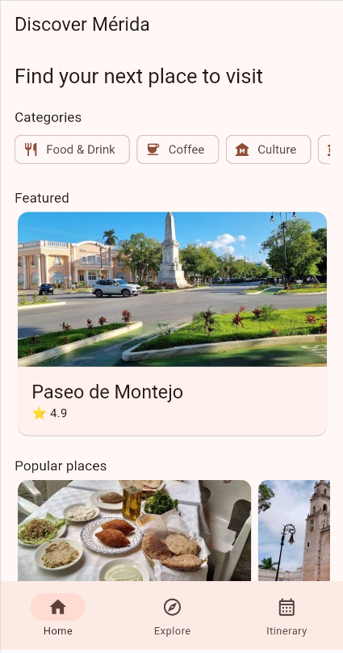
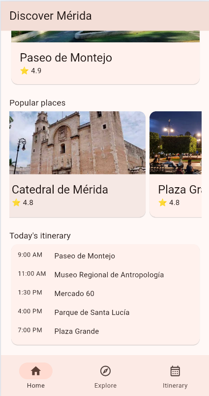
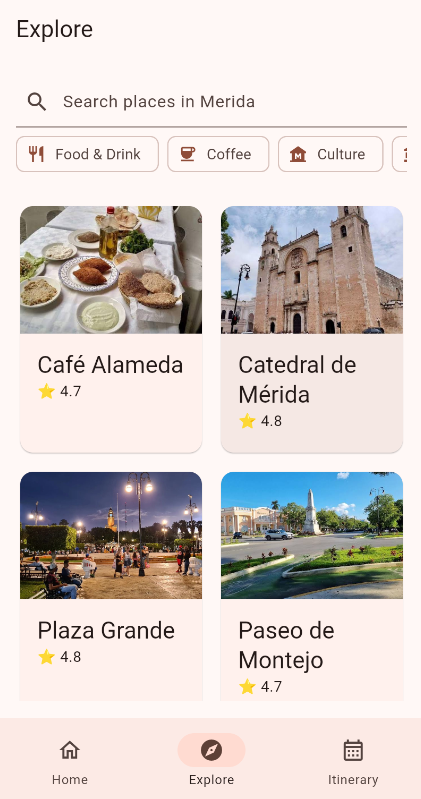
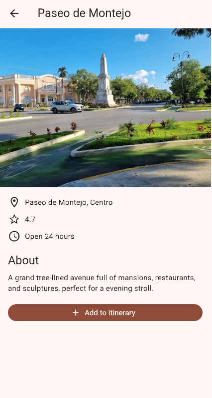

# Travel Itinerary

A Flutter app to explore places in Mérida, Yucatán, with a browsable
landing page and search and filtering by location type.

<p>
  
  
  
  
</p>

## Features

- **Landing page** with featured places in Mérida
- **Place detail** detailed information about a location
- **Search and filter** to find places by name and category
- Custom layouts and reusable widgets for place cards and lists

### In progress

- [ ] Create and save a personal itinerary

## Tech stack

- **Flutter / Dart**
- using hardcoded jason data for this project

## What I focused on

- Building responsive layouts with Flutter's layout widgets
  (Row, Column, Stack, ListView, GridView)
- Composing reusable widgets for cards and filter chips
- Implementing search and filtering logic over a list of places

## Getting started

```
git clone https://github.com/carlos943new/itinerary.git
cd itinerary
flutter pub get
flutter run
```

## Roadmap

- Itinerary creation flow
- Persist data (Firestore or local storage)
